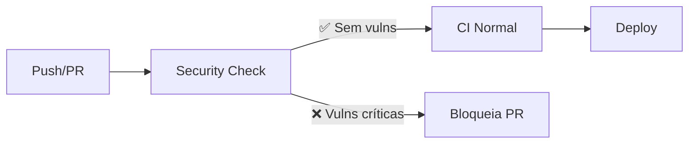
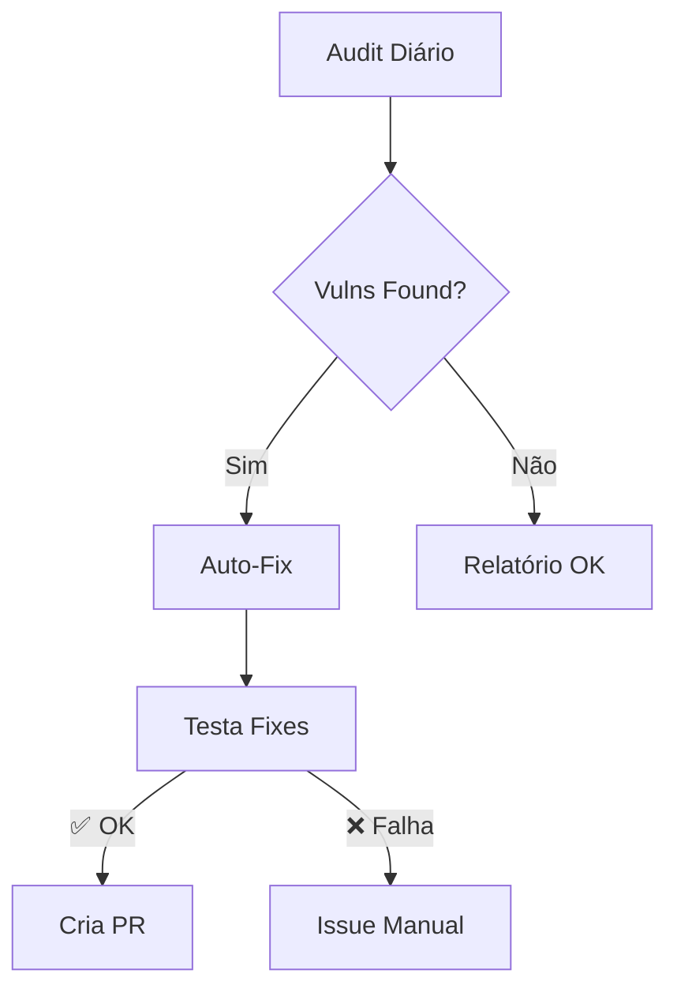
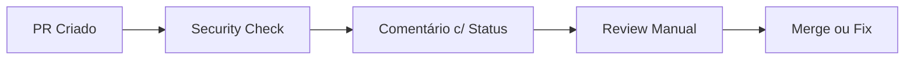

# 🛡️ Security CI/CD System

Este documento descreve o sistema completo de CI/CD com foco em segurança implementado no projeto.

## 📋 Workflows Implementados

### 1. 🔍 Security Audit (`security-audit.yml`)
**Execução**: Diária às 2h UTC + Manual + Mudanças em dependências

#### Funcionalidades
- ✅ **Auditoria completa de vulnerabilidades** (critical, high, moderate)
- 🔧 **Correção automática** de vulnerabilidades não-breaking
- 📤 **Criação automática de PRs** com fixes de segurança
- 📊 **Relatórios detalhados** com análise de dependências
- 🏥 **Health check semanal** de dependências
- 📈 **Tracking de métricas** de segurança

#### Triggers
```yaml
# Execução diária
schedule: '0 2 * * *'  # 2 AM UTC

# Execução manual com parâmetros
workflow_dispatch:
  inputs:
    severity: [critical|high|moderate|low]
    auto_fix: boolean
    force_update: boolean

# Em mudanças de dependências
pull_request/push:
  paths: ['package.json', 'pnpm-lock.yaml', '.npmrc']
```

#### Jobs
1. **🔍 Security Audit**: Análise completa de vulnerabilidades
2. **🔧 Auto-Fix**: Aplicação automática de correções
3. **📊 Health Check**: Relatório de dependências (semanal)
4. **📋 Summary**: Resumo executivo de segurança

### 2. ⚡ Security Check (`security-check.yml`)
**Execução**: Todo PR + Push nas branches principais

#### Funcionalidades
- 🚀 **Verificação rápida** (< 2 min)
- ❌ **Falha CI** se vulnerabilidades high/critical
- 💬 **Comentários automáticos** em PRs
- 📊 **Summary detalhado** no GitHub Actions

#### Estratégia
```bash
# Executa pnpm audit --audit-level=high
# Se falhar → exit 1 (bloqueia merge)
# Se passar → continue CI pipeline
```

### 3. 🚀 Enhanced Homolog (`homolog.yml`)
**Execução**: Push para branch `homolog`

#### Melhorias Adicionadas
- 🛡️ **Security audit integrado** no pipeline existente
- 📊 **Relatórios de vulnerabilidades** em summary
- ⚠️ **Warnings não-bloqueantes** para visibilidade
- 🏗️ **Mantém funcionalidade existente** (lint, test, build)

## 🔄 Fluxo Completo de Segurança

### Cenário 1: Desenvolvimento Normal


### Cenário 2: Vulnerabilidades Detectadas


### Cenário 3: PR Review Process


## ⚙️ Configurações

### Variáveis de Ambiente
```yaml
env:
  NODE_VERSION: '20.x'
  PNPM_VERSION: '9.15.2'
  AUDIT_LEVEL: 'moderate'  # Para auditorias diárias
```

### Secrets Necessários
- `GITHUB_TOKEN`: Automático (criação de PRs)
- Existing AWS secrets mantidos para deploy

### Permissões
```yaml
permissions:
  contents: write          # Para criar PRs
  issues: write           # Para comentários
  pull-requests: write    # Para PR reviews
```

## 📊 Relatórios e Outputs

### Artifacts Gerados
- `security-audit-report`: JSON + TXT com detalhes
- `dependency-health-report`: Status das dependências
- `post-fix-audit`: Resultado pós-correção

### GitHub Step Summary
Cada workflow gera summary detalhado:
- 📈 Métricas de vulnerabilidades
- 🔧 Ações aplicadas
- 📋 Próximos passos
- 🔗 Links para PRs/relatórios

## 🚨 Alertas e Notificações

### Em PRs
- ✅ **Status check verde**: Sem vulnerabilidades critical/high
- ❌ **Status check vermelho**: Vulnerabilidades bloqueantes
- 💬 **Comentário automático**: Detalhes das vulnerabilidades

### Em Auditorias Diárias
- 📧 **GitHub notifications**: Para PRs de security
- 🏷️ **Labels automáticas**: `security`, `dependencies`, `automated`
- 👤 **Assignee**: Usuário que triggou o workflow

## 🛠️ Manutenção e Operação

### Execução Manual
```bash
# Via GitHub UI
Actions → Security Audit → Run workflow

# Parâmetros disponíveis:
- Severity: critical|high|moderate|low
- Auto Fix: true|false  
- Force Update: true|false
```

### Troubleshooting

#### Workflow falhando
1. Verificar logs detalhados no step que falhou
2. Checar se dependências estão instaladas corretamente
3. Validar se secrets/tokens estão configurados

#### PRs não sendo criados
1. Verificar permissões do `GITHUB_TOKEN`
2. Confirmar que há fixes aplicáveis
3. Checar se branch pattern não conflita

#### Audit "falso positivo"
1. Analisar se vulnerabilidade é relevante para o projeto
2. Considerar adicionar override no `package.json`
3. Documentar decisão no PR ou issue

## 🔧 Customização

### Ajustar Severidade
```yaml
# Em security-audit.yml
env:
  AUDIT_LEVEL: 'high'  # critical, high, moderate, low

# Em security-check.yml
run: pnpm audit --audit-level=critical  # Mais restritivo
```

### Modificar Frequência
```yaml
# Execução a cada 6 horas
schedule:
  - cron: '0 */6 * * *'

# Apenas dias úteis às 8h
schedule:
  - cron: '0 8 * * 1-5'
```

### Adicionar Integrações
```yaml
# Slack notification
- name: Notify Slack
  if: steps.audit.outputs.has-vulnerabilities == 'true'
  uses: 8398a7/action-slack@v3
  with:
    webhook_url: ${{ secrets.SLACK_WEBHOOK }}
    text: "Security vulnerabilities found!"

# Teams notification
- name: Notify Teams
  uses: aliencube/microsoft-teams-actions@v0.8.0
```

## 📈 Métricas e KPIs

### Tracking Sugerido
- **MTTR (Mean Time to Remediation)**: Tempo médio para correção
- **Vulnerability Density**: Vulnerabilidades por dependência
- **Fix Success Rate**: Taxa de sucesso de correções automáticas
- **False Positive Rate**: Taxa de "falsos positivos"

### Dashboards
Considere integrar com:
- GitHub Insights
- Grafana + Prometheus
- Datadog / New Relic
- Security scorecard tools

## 🎯 Best Practices

### Para Desenvolvedores
1. **Sempre revisar PRs** de security fixes antes de merge
2. **Testar localmente** após aplicar fixes
3. **Documentar** decisões sobre vulnerabilidades aceitas
4. **Não ignorar** warnings de security check

### Para DevOps/SRE
1. **Monitorar regularmente** execuções dos workflows
2. **Ajustar thresholds** conforme necessário
3. **Manter documentação** atualizada
4. **Revisar métricas** mensalmente

---

**📝 Última atualização**: 2025-10-24  
**🔗 Repositório**: sbr-digital/erp-api  
**👥 Responsável**: SBR Digital Security Team
